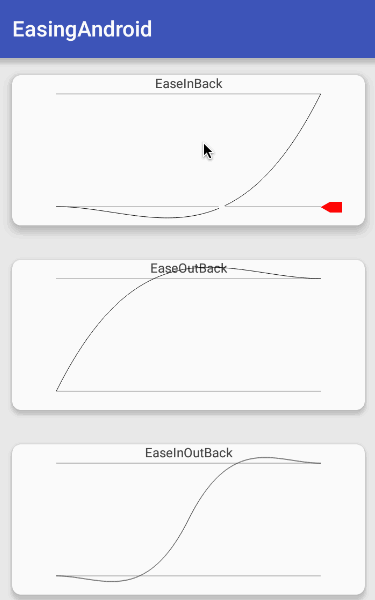

### Easing-Android

[  ]
(https://bintray.com/ydcool/maven/easing-android/_latestVersion)

[](https://travis-ci.org/Ydcool/EasingAndroid)

Android easing interpolators.Based on http://easings.net

#### Demo

##### ScreenCapture



##### Demo Download

Directly download demo [apk](http://7xiilm.com1.z0.glb.clouddn.com/apk%2Feasing_android_demo.apk)  or scan ![qrCode]
(https://api.qrserver.com/v1/create-qr-code/?data=http://7xiilm.com1.z0.glb.clouddn.com/apk%2Feasing_android_demo.apk&size=100x100)

#### Install

##### Gradle

```java 
    dependencies {
        compile 'me.ydcool.lib:easing-android:latest.integration'
    }
```

#### Usage

Use easing interpolators same as android build-in interpolators.

```java 
    AlphaAnimation animation = new AlphaAnimation(0.f,1.f);
    animation.setDuration(300);
    animation.setInterpolator(new EaseOutCubicInterpolator());
    mView.startAnimation(animation);
```

#### License
 
    Copyright 2016 Ydcool
    
    Licensed under the Apache License, Version 2.0 (the "License");
    you may not use this file except in compliance with the License.
    You may obtain a copy of the License at
  
    http://www.apache.org/licenses/LICENSE-2.0
    
    Unless required by applicable law or agreed to in writing, software
    distributed under the License is distributed on an "AS IS" BASIS,
    WITHOUT WARRANTIES OR CONDITIONS OF ANY KIND, either express or implied.
    See the License for the specific language governing permissions and
    limitations under the License.
    
